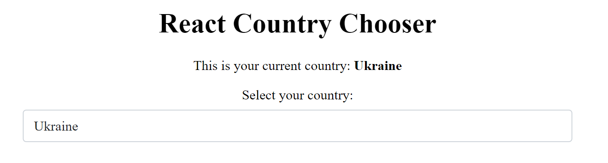

# Web components

For this exercise I tried two approaches. There is a library for angular, that allows generation of web-components from angular-components. This library is called [@angular/elements](https://angular.io/guide/elements).

## Angular Elements

The `auto-complete` component, which was written with angular can be found here: 

`libs/ui-angular/src/lib/auto-complete/auto-complete.component.ts`

This file contains the component as well as the module for the component (SCAM).

Afterwards i compiled the component with `@angular/elements`. The resulting component can be found here

`libs/ui-angular/src/generated/auto-complete.js`

I prettified the file for better readability. Even this simple component generates 9931 lines of code.

The problem with this approach was, that i can't export generated component in my library. The generated component doesn't have any exports which i can use. So i had to copy the file to the `assets/`-folder of the application and import it with a script tag.

`/apps/frontend-angular/src/index.html:`
```html
<body>
  <fh-sfr-frontend-root></fh-sfr-frontend-root>
  <script type="text/javascript" src="assets/auto-complete.js"></script>
</body>
```

For me personally, this approach is not very suitable.

If the native web-compoent and generated component from angular are compared some similarities can be found.

## Native Web Components

In my second approach i implemented a native web-component with typescript.

The implementation is located in:

`/libs/web-components/src/lib/auto-complete.ts`

Implementing a simple web-component is pretty straightforward, but implementating a more complexing web-component can be very tricky. Complex logic has to be implemented by the developer, which would normally be done by a library like react or a framework like angular. For example i had to get the html-elements in javascript and append the option-elements to them. Implementating large templates might lead to very complex examples.

### Using web-components in angular

For angular to support custom-elements I had to add the `CUSTOM_ELEMENTS_SCHEMA` to the app-module of the application.

```ts
@NgModule({
  declarations: [AppComponent],
  imports: [BrowserModule, HttpClientModule],
  providers: [],
  schemas: [CUSTOM_ELEMENTS_SCHEMA],
  bootstrap: [AppComponent],
})
export class AppModule {}
```

And i imported my web-components from the library inside the `main.ts`

`/apps/frontend-angular/src/main.ts`:
```ts
import '@fh-sfr-frontend/web-components';
```

This was pretty simple compared to the approach with `@angular/elements`.

### Using web-components in react

For react to recognize web-components i had to add a `intrinsic.d.ts` file to the src/root of the application.

```ts
declare namespace JSX {
  interface IntrinsicElements {
    [elemName: string]: any;
  }
}
```

And i imported my web-components from the library inside the `main.tsx`

`/apps/frontend-react/src/main.tsx`:
```ts
import '@fh-sfr-frontend/web-components';
```

### Results

The following image shows the web-component used in angular:


The following image shows the web-component used in react:




In both applications the web-component works very well. The style is contained inside the component, so the component looks the same in angular and react.

## Running the applications

Running angular-frontend:

```bash
nx serve frontend-angular
```

Running react-frontend:

```bash
nx serve frontend-react
```